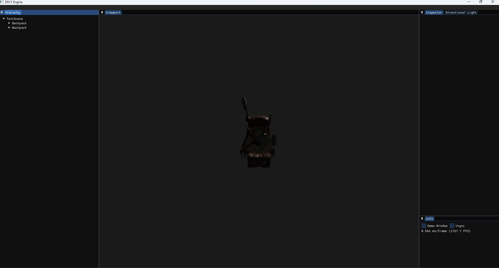

# Custom DirectX 11 Rendering Engine in C++

DX11Engine is a custom rendering engine built from scratch in C++ using DirectX 11. It currently supports object loading, camera movement, shader programming, and Phong lighting. The engine is designed as a foundation for developing a full-featured game engine. Recent improvements introduced a functioning Scene/Entity relation aswell as extended ImGui Context Menus.

## Technologies Used
- **C++** - core programming language
- **DirectX 11** - graphics API and rendering pipeline
- **Dear ImGui** - GUI overlay for engine control
- **STB** - texture loading
- **Assimp** - 3D model import
- **Spdlog** - Logging
  
## Current Features / Skills Demonstrated
- 3D object loading - experience with model import and asset management
- Camera movement - basic 3D navigation and input handling
- Texture loading & shader programming - low-level graphics pipeline implementation
- Basic lighting (Phong) - applied lighting models in real-time rendering

## Currently Working On
- Dear ImGui Overlay Improvements
- Kind of ECS

## Planned Enhancements
- Implement Physically Based Rendering (PBR) - advanced graphics rendering
- Improve GUI overlay with Dera ImGui - enhanced visualization and debugging
- Add multithreading support - performance optimization for complex scenes

## Inspiration
This engine builds upon Rastertek's DirectX 11 tutorials as a learning foundation. All implementations have been extended and customized.

## Current State / How the Engine Looks

